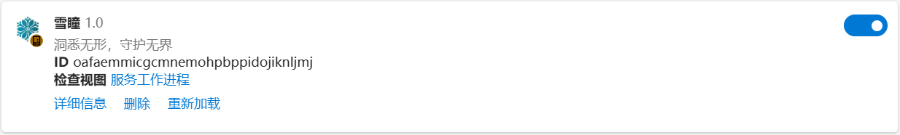
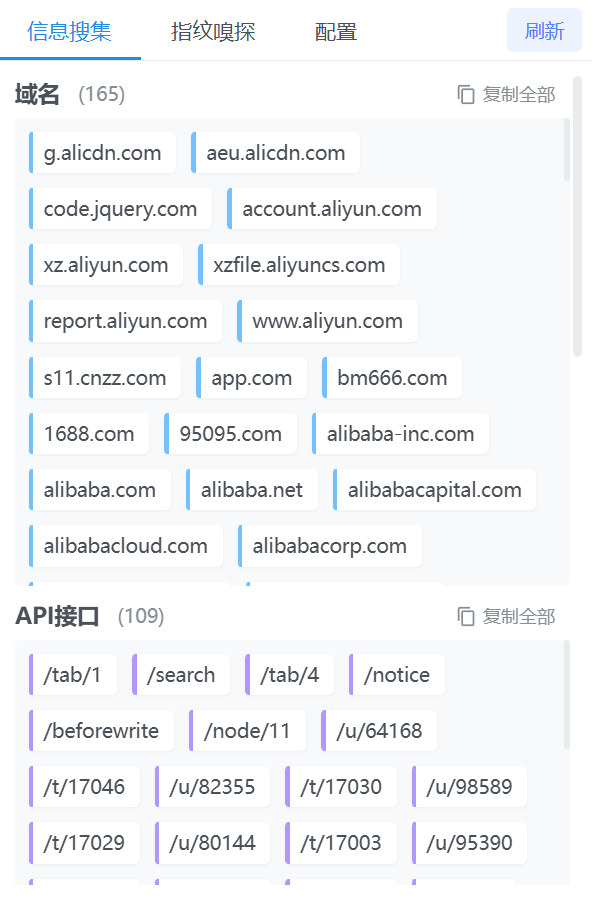
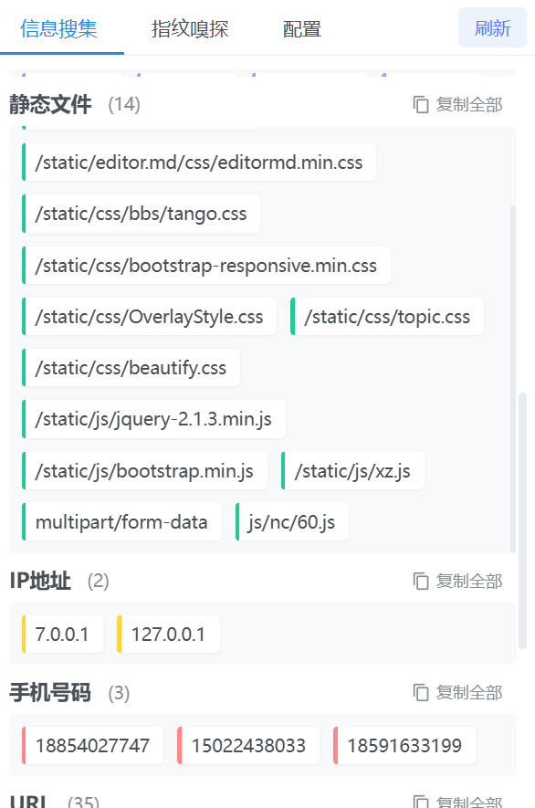
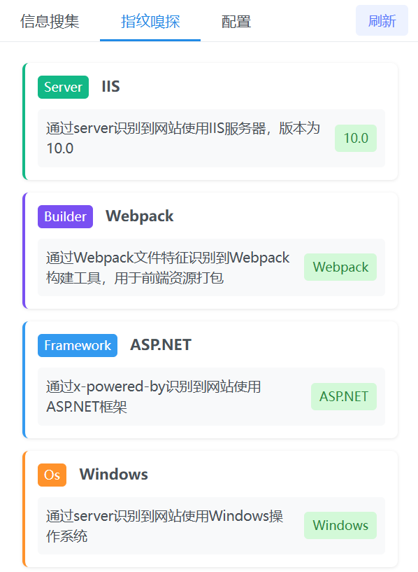
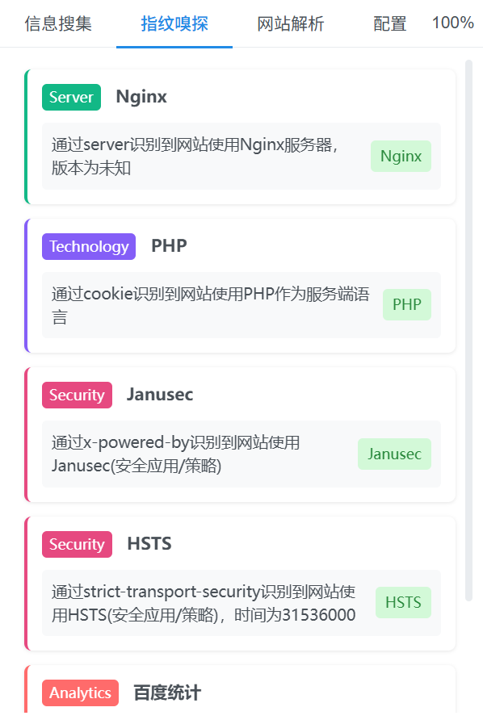
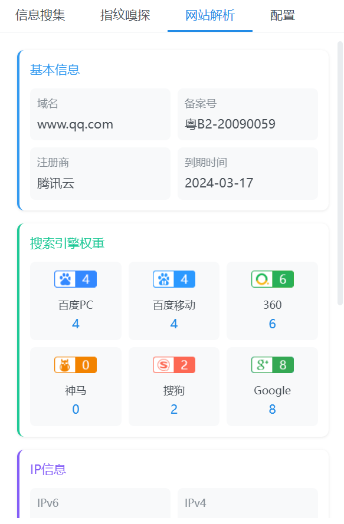
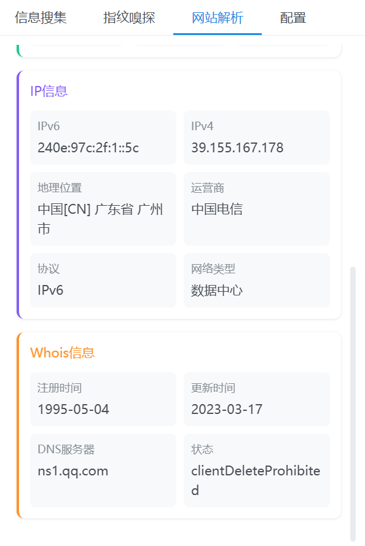
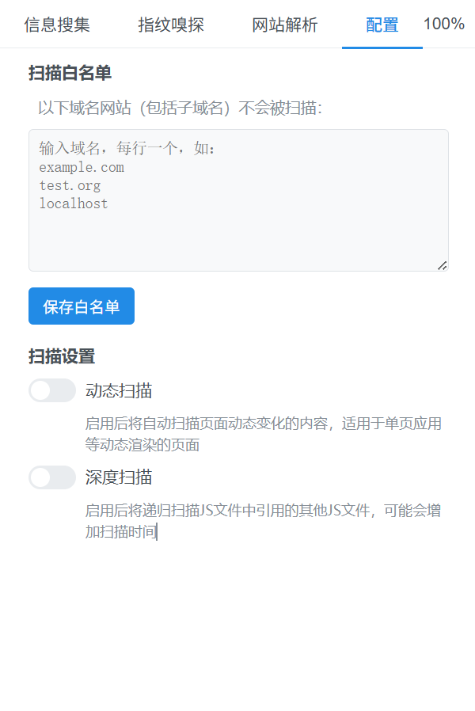
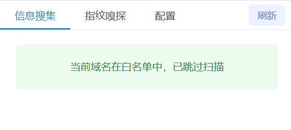

  
  <h1>雪瞳 (SnowEyes)</h1>
  
<strong>洞悉无形，守护无界。</strong>

**雪瞳** 是一款用于检测和提取网页中敏感信息的 Chrome 浏览器扩展，旨在帮助用户快速获取网页中的敏感信息，并进行分析和处理。

---

> [!WARNING]
> ## 停更公告
> 
> 很抱歉，因为一些原因，未来雪瞳将停止更新和开源，后续若有更新仅限内部使用。
>虽然雪瞳尚有不足，但作为一款信息收集类插件，雪瞳目前的基础搜索能力远超同类工具，使用过的师傅应该对雪瞳的能力有目共睹，感谢师傅们一直以来的关注和支持，也感谢诸位师傅此前在公众号/网页/视频的宣传，如需更多功能还请移步其他师傅的工具，未来恕雪瞳不能相伴，最后，祝师傅们身体健康，天天爆洞，有时间多陪陪家人。
> 如需联系请+wx：Is_Sickle_ya

## 功能特点

- **多维信息检测**：实现对多种敏感信息、网站指纹的检测与分类。
- **动态内容扫描**：支持动态扫描，实时捕获由 JavaScript 动态渲染的网页信息。
- **深度扫描技术**：针对某些 JS 文件中嵌套加载其他 JS 的网站，进行深度扫描，确保信息完整性。
- **Webpack 适配**：优化对 Webpack 打包的网页的 JS 搜集能力。

## 安装指南
###  从浏览器的扩展商店安装

|        浏览器          | 状态 |
|:----------------------:|:--------------------------------------------------------------------------------------------------------------------------------------------|
| Firefox Add-ons |   |

### 从源码安装
1.  下载本项目源码（通过 `git clone` 或下载 ZIP 压缩包）。
2.  解压下载的文件。
3.  打开 Chrome/Edge 浏览器的 **扩展程序** 页面 (`chrome://extensions/` 或 `edge://extensions/`)。
4.  在页面右上角，启用 **“开发者模式”**。
5.  点击 **“加载已解压的扩展程序”**，然后选择刚刚解压的源码文件夹。
6.  插件将出现在您的扩展列表中，可以开始使用。

## 使用技巧

- **查看来源**：鼠标悬浮在任意一条结果上，即可看到该信息的来源 URL。
- **复制结果**：
  - **左键单击**：复制信息来源的 URL。
  - **右键单击**：复制该条结果的内容。
- **跳转链接**：按住 `Ctrl` 并同时**左键单击**，可以直接在浏览器新标签页中打开来源链接。

## 界面展示

点击展开/折叠截图

| 插件主界面 |
| :---: |
|  |

| 信息收集页面 |
| :---: |
|   |

| 指纹嗅探页面 |
| :---: |
|   |

| 网站解析页面 |
| :---: |
|   |

| 配置与白名单 |
| :---: |
|   |

## 注意事项

1.  **扫描卡顿**：在遇到包含大量 JS 文件的网站时，扫描可能需要较长时间，页面可能会出现短暂卡顿。
2.  **未知 Bug**：程序仍在不断完善中，可能会遇到未知 Bug。欢迎通过 [Issues](https://github.com/SickleSec/SnowEyes/issues) 提出您遇到的问题或改进建议。
3.  **深度扫描**：此功能在某些情况下可能会出现 JS 误匹配，建议在常规扫描无法满足需求时再使用。
4.  **备案查询**：建议注册并使用 [接口盒子](https://cn.apihz.cn/) 自己的 ID 和 Key，因为公开接口有查询频率限制。

## 第三方接口

本插件调用了以下优秀的第三方免费接口，特此感谢：

- [米人API](https://api.mir6.com/)
- [接口盒子](https://cn.apihz.cn/)

## 更新历史

点击展开/折叠

### v0.2.7.3
- 大幅优化搜索时的网页卡顿问题，体验更流畅。
- 适配 Webpack 网页的 JS 搜集，绝不放过每一处可能存在的 JS。
- 火狐插件已同步更新到 v0.2.7.3 版本。

### v0.2.7.2
- **新增**：来源显示（鼠标悬停显示，左键复制，Ctrl+左键跳转）。
- **新增**：自定义白名单功能。
- **新增**：扫描进度条，实时查看扫描进度。
- **优化**：解决了访问部分网页时的卡顿情况，体验更丝滑。
- **优化**：扫描处理逻辑，处理速度更快，JS 搜集更全面。
- **优化**：深度扫描新增 JS 文件路径猜解拼接，提高访问命中率。
- 其他细节优化。

## Star History
