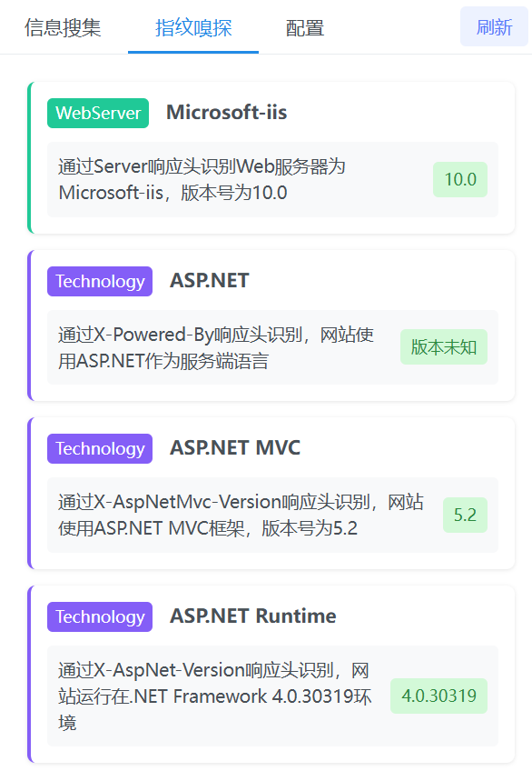

    

# 雪瞳

**雪瞳** 是一款用于检测和提取网页中敏感信息的 Chrome 浏览器扩展。它能够实时扫描网页内容，从html和js文件中精准捕获并展示各类敏感数据。

---

## 功能特点

### 1. 多类型信息检测
- **域名检测**
- **API 接口路径**
- **IP 地址**
- **手机号码**
- **邮箱地址**
- **账号密码**
- **Cookie**
- **身份证号**
- **文档文件**
- **JS文件**
- **图片资源**
- **URL 链接**
- **JWT Token**
- **···**

### 2. 实时扫描
- 页面加载完成后自动开始扫描
- 支持增量式扫描，获取一个资源就立即处理
- 定期更新扫描结果，无需等待所有资源加载完成

### 3. 全面的资源收集
- HTML 内容扫描
- JavaScript 文件内容扫描
- Meta 标签内容检测
- 数据属性检测
- 外部资源链接检测
- 大文件分块处理

### 4. 智能过滤
- 域名黑名单过滤
- URL 解码和清理
- 垃圾信息自动过滤

### 5. 用户友好界面
- 分类展示检测结果
- 支持一键复制单个结果
- 支持复制分类下所有结果
- 实时显示检测数量
- 刷新按钮重新触发检测

### 6. 配置查看
- 白名单展示

---

## 界面展示
### 插件

    

### 信息收集页面

    
    
    

### 白名单页面

    

### 指纹嗅探页面（静态，开发中）

    

---

## 注意事项

程序仍在开发中，很多功能都没有完善，体验不好还请见谅。

1. 扩展需要网页访问权限才能进行检测。
2. 大型网页的完整扫描可能需要一定时间。
3. 可能会出现未知bug。

---

## 更新日志

### 2025-01-11
- 界面初步设计
- 域名和 API 正则初步完善
- 右键单击结果复制，全部复制
- 结果长度自适应

### 2025-01-12
- 新增顶部导航栏
- 增加配置页面（静态）
- 移除信息搜索页面下的顶栏
- 修复扫描文件过大出现栈溢出的情况
- 优化扫描流程，在扫描到资源后会立马显示到页面上

### 2025-01-13
- 完善了身份证号和手机号码的正则匹配
- 修改了信息搜集页面样式，内容更加紧凑
- 增加了白名单功能
- 修改了页面样式（信息搜集，配置页面）
- 新增指纹嗅探页面（静态）
- 新增完善静态文件匹配
- 完善手机号的正则匹配
- 完善 API 匹配，增加过滤器

### 2025-01-14
- 内网 IP 匹配
- 完善了 URL 的匹配，使其能够匹配 IP 以及更多协议
- 设计了 Logo，优化文档排版样式
- 修复配置信息不能展示的问题
### 2025-01-15
- 删除冗余代码
- 增加第三方库过滤，减少不必要的搜索
- 完善API分离逻辑，增加更多的三方库
- 拆分静态资源，提取js，文档和图片
- 完善URL的过滤
### 2025-01-16
- 完善API匹配逻辑
- 新增模块路径，拆分细化API
- 更改三方库的匹配规则
- 增加更多的过滤集
- 修复js搜集出错的bug
### 2025-01-17
- 修改域名匹配，域名获取更加精准
- 移除hash的匹配
- 继续细化API匹配，将其拆分为相对路径和绝对路径
- 优化了身份证的正则，减少误匹配
### 2025-01-20
- 完善IP匹配，ip获取更加精准
- 修复零宽断言和全局标志导致出现循环bug
- 划分url，提取github链接
- 完善邮箱匹配，减少邮箱误匹配
- 新增公司机构检测
### 2025-01-21
- 删除冗余代码，修复一些显示错误
### 2025-01-22
- 新增账号密码，cookie匹配
- 强化API，域名过滤规则
- 增加更多过滤集
- 完善cookie和账户密码匹配
### 2025-01-23
- 新增ID密钥匹配
- 添加微信ID的匹配
- 完善用户名密码搜索
- 添加各类accesskey的匹配
- 动态页面适应匹配
- 优化处理逻辑，减少内存消耗

---

**雪瞳——洞悉无形，守护无界。**