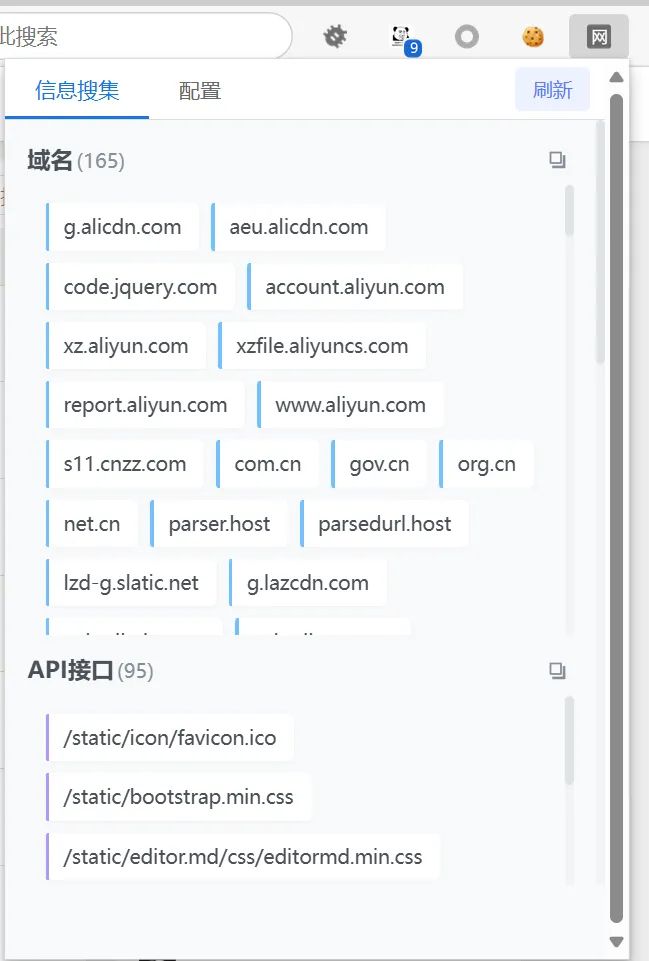
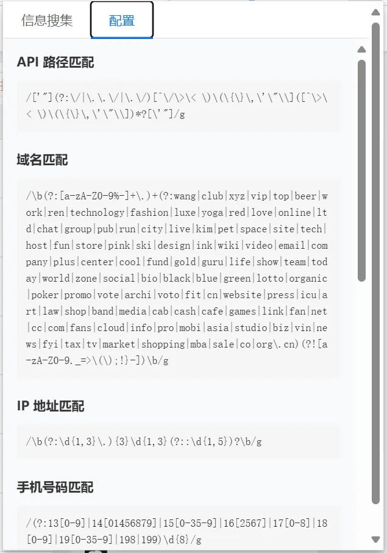

# 雪瞳

雪瞳是一个 Chrome 浏览器扩展，用于检测提取网页中的敏感信息，指纹探测等功能。它能够实时扫描网页内容，识别并展示各类敏感数据。

## 功能特点

### 1. 多类型信息检测
- 域名检测
- API 接口路径
- IP 地址（包括内网 IP）
- 手机号码
- 邮箱地址
- 身份证号
- URL 链接
- JWT Token
- AWS Access Key
- 哈希值（MD5/SHA1/SHA256）

### 2. 实时扫描
- 页面加载完成后自动开始扫描
- 支持增量式扫描，获取一个资源就立即处理
- 定期更新扫描结果，无需等待所有资源加载完成

### 3. 全面的资源收集
- HTML 内容扫描
- JavaScript 文件内容扫描
- Meta 标签内容检测
- 数据属性（data-*）检测
- 外部资源链接检测

### 4. 智能过滤
- 域名黑名单过滤
- JavaScript 关键字过滤
- 特殊格式域名识别
- 内网 IP 地址识别
- URL 解码和清理

### 5. 用户友好界面
- 分类展示检测结果
- 支持一键复制单个结果
- 支持复制分类下所有结果
- 实时显示检测数量
- 刷新按钮重新触发检测

### 6. 配置查看
- 支持查看所有检测规则
- 正则表达式模式展示
- 黑名单规则展示

## 界面展示

## 注意事项

1. 扩展需要网页访问权限才能进行检测
2. 部分外部资源可能因跨域限制无法访问
3. 大型网页的完整扫描可能需要一定时间
4. 建议定期更新黑名单规则以提高准确性

## 更新日志

### 2025-01-11
- 界面初步设计
- 域名和API正则初步完善
### 2025-01-12
- 新增顶部导航栏
- 增加配置页面（静态）
- 移除信息搜索页面下的顶栏
- 修复扫描文件过大出现栈溢出的情况
- 优化扫描流程，在扫描到资源后会立马显示到页面上
### 2025-01-13
- 完善了身份证号和手机号码的正则匹配
- 修改了信息搜集页面样式，内容更加紧凑
- 增加了白名单功能
- 修改了页面样式（信息搜集，配置页面）